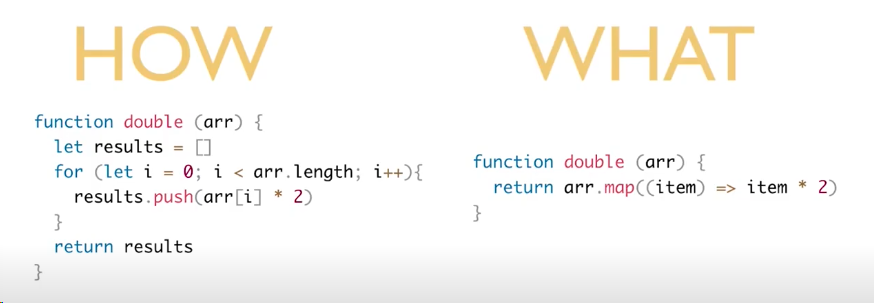
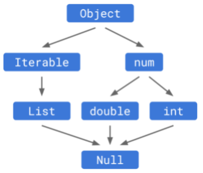
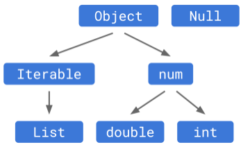
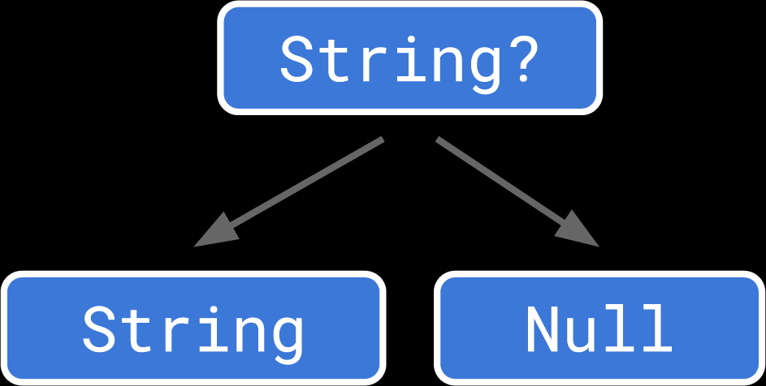

# Dart notları

## foo title

### Declarative and Imperative programming

- *When the state of your app changes (for example, the user flips a switch in the settings screen), you change the state, and that triggers a redraw of the user interface. There is no imperative changing of the UI itself (like widget.setText)—you change the state, and the UI rebuilds from scratch.* [flutter.dev](https://flutter.dev/docs/development/data-and-backend/state-mgmt/declarative#:~:text=of%20your%20app%3A-,When%20the%20state,-of%20your%20app)
- left is imperative; right is declarative (abstracting logic behind other methods and not doing everything explicityl)
  
- And Flutter is more like a declarative framework

### What Business Logic means?

- *we use libraries on projects only if the need is clearly remarkable. However, when we use a library, it is our responsibility and mission to separate it from critical parts of our code, which is the Business Logic.* [medium](https://medium.com/@abderrahim.benmakhlouf/why-flutter-react-native-should-not-be-part-of-your-business-logic-the-duty-of-the-developer-f7195b07d90d#:~:text=As%20Professional%20Developers%2C-,we%20use%20libraries,-on%20projects%20only)
- *In Clean Architecture, for example, which respects those principles, the goal is to separate the concerns and roles that can be categorized into :*
  1. UI (User Interface)
  2. Formatter (the format, the legal part, the content)
  3. Business Logic (the Business rules)
  4. Data (can be in-memory, network like APIs or Online Database or local persistent store/database)*

### State Management in Flutter

- [State management approaches]([https://link](https://flutter.dev/docs/development/data-and-backend/state-mgmt/options))
- Provider is recomended and used by Google itself.
- *Provider is a complete dependency injection solution. Where ScopedModel provides the same functionality in terms of reactivity using the Model class + notifyListeners(). Provider is a dependency injection solution, with some very powerful provider types that takes care of boiler plate things like managing streams for instance.*

### Libraries

- [dart:core](https://api.dart.dev/stable/2.13.4/dart-core/Iterable-class.html)
  - [iterable.dart](https://api.dart.dev/stable/2.13.4/dart-core/Iterable-class.html)

### Dart.dev

- [language cheatsheet](https://dart.dev/codelabs/dart-cheatsheet): short introductory to dart language with examples

### Other Sources

- [javatpoint](https://www.javatpoint.com/dart-programming)

### Generic Types ( ``T`` )

- *Later, you decide you want a number-specific version of this interface… You get the idea.*

- *Generic types can save you the trouble of creating all these interfaces. Instead, you can create a single interface that takes a type parameter:*

  ```dart
  abstract class Cache<T> {
  T getByKey(String key);
  void setByKey(String key, T value);
  }
  ```

- *In this code, T is the stand-in type. It’s a placeholder that you can think of as a type that a developer will define later.*

### Private and Public variables

- *Placing multiple classes together in one library can enable some useful patterns. Since privacy in Dart works at the library level, not the class level, this is a way to define “friend” classes like you might in C++. Every class declared in the same library can access each other’s private members, but code outside of that library cannot.*

### Arrow Function

```dart
int add(int i1, int i2) => i1 + i2;```

### Named Parameters
```dart
getHttpUrl(String server, String path, {int port = 80}) {
  // ...
}
```

```dart
getHttpUrl('example.com', '/index.html', port: 8080); // port == 8080
getHttpUrl('example.com', '/index.html');            // port == 80
```

### static, final and const keywords

- *static means a member is available on the class itself instead of on instances of the class. That's all it means, and it isn't used for anything else. static modifies members.*

- *final means single-assignment: a final variable or field must have an initializer. Once assigned a value, a final variable's value cannot be changed. final modifies variables.*

- *const has a meaning that's a bit more complex and subtle in Dart. const modifies values. You can use it when creating collections, like const [1, 2, 3], and when constructing objects (instead of new) like const Point(2, 3). Here, const means that the object's entire deep state can be determined entirely at compile time and that the object will be frozen and completely immutable.*
[stackoverflow answer](https://stackoverflow.com/questions/65736642/difference-between-static-and-const-variable-in-dart#:~:text=the%20declaration%20for%20cons%20must%20using%20const%2C%20you%20have%20to%20declare%20it%20as%20static%20const%20rather%20than%20just%20const.)

### Positional Parameters (choose *named* over positional)

```dart
getHttpUrl(String server, String path, [int port=80, int numRetries=3]) {
  // ...
}
```

```dart
getHttpUrl('example.com', '/index.html');
getHttpUrl('example.com', '/index.html', 8080);
getHttpUrl('example.com', '/index.html', 8080, 5);
```

- you can use either optional or positional parameter not both at the same time

### Single Responsibility Principle (srp)

every function need to do 1 thing and 1 thing only

### Side effects and naming convention (on functions)

Use camelCase while naming functions
If your code does something other than returning a value (like calling another function) it causes side effects.
Side effect functions should start with a verb describing the task; otherwise not neccessary

### Anonymous functions

Also referred as first-class citizens. That means these functions can be:

- assigned to variables
- can be passed as parameters of functions
- can be returned by other functions

assign to variable

```dart
Function add = (int a, int b){
    return a + b;
};
```

pass as parameter

```dart
void doSomething(Function callback){
  print(callback.call());
}

void main(){
    doSomething((){
    return 'Hello there!';
  });
}
```

return by other function

```dart
Function applyMultiplier(num multiplier) {
  return (num value) {
    return value * multiplier;
  };
}

void main(){
  var triple = applyMultiplier(3);
  print('the triple of 4 is ${triple(4)}');
}
```

use with forEach

```dart
const values = [2, 3, 4, 5];

values.forEach((value) { 
    print('double of $value is ${value * 2}');
});
```

### Classes and OOP

Naming convention: CamelCase

Class property means variables in class

Class methods means functions in class

Overriding a method:

```dart
class Car {
  String? make;
  String? bodyType;

  String toJson() {       //JSON serialization (for database related queries)
    return '{"make":$make,"bodyType":"$bodyType"}';
  }

  @override               //Overriding a function so we can do whatever we want with it
  String toString() {
    return 'Car(make:$make, bodyType:$bodyType)';
  }
}
```

```dart

void main(){
  var car = Car();
  print(car);   //invokes toString method. since we overrode it in our class, it shows the values instead of "Instance of car"
}
```

### Cascade Notation

```dart
car = Car()
  ..make = 'Nissan'
  ..bodyType = 'SUV';
print(car.toJson());
```

### Spread operator

- Gets all the values from a list
- In Dart:

```dart
List<String> values1 = ['one', 'two', 'three'];
List<String> values2 = ['four', 'five', 'six'];
var output = [...values1,...values2];
print(output); 
              // [one, two, three, four, five, six]
```

In Flutter

```dart
Column(
        children: [
        ...values.map((value) {
            return Text(value);
          }),
        ],
      ),
```

### Short form unnamed constructor

```dart
Card(this.brand, this.type);
```

### Named constructor (use forwarding constructor instead)

```dart
//* named constructors
// ClassName.identifierName()

  Car.trucks(){
    brand = '';
    type = 'Truck';
  }

  Car.sedans(){
    brand = '';
    type = 'Sedan';
  }
```

Call from main like this:

```dart
var car = Car.trucks();
```

### Forwarding constructor

In class, define the constructor like this:

```dart
Car.suv() : this('Toyota', 'SUV');
```

Call from main:

```dart
var car = Car.suv();
```

### Constructor with named parameters

```dart
Car({ this.brand, this.type});
```

Call from main like this:

```dart
var car = Car(brand: "Mazda", type:"SUV");
```

### `assert` keyword

Useful debugging tool

```dart
Client({int userId = 0, String name = '', double balance = 0}) : 
assert(balance >= 0),
_id = userId,
_name = name,
_accountBalance = balance;
```

### Variable protection

```dart
class Car{
  final String? name;
  
  Car({this.name = ''}) //assigns once in initialization because of final field.
}
```

### Private variable in class

```dart
class Car{
  String? _name; //this property can't be reached out of class.
                 //can be reached in the same file.
                 //so write classes in other files if you want private properties
}

```

### Const constructors

```dart
class SmartPhone{
  final String brand;
  final double price;

  const SmartPhone({this.brand = '', this.price = 0}); //for the same valued objects, it doesn't creates a new object. good for enums, annotations etc.

  @override
  String toString() {
      return 'brand: $brand\nprice: $price';
    }
}
```

### Generative and Factory constructors

Use a factory in situations where you don't necessarily want to return a new instance of the class itself. Use cases:

the constructor is expensive, so you want to return an existing instance - if possible - instead of creating a new one;

- you only ever want to create one instance of a class (the singleton pattern);
- you want to return a subclass instance instead of the class itself.

**Explanation**

A Dart class may have generative constructors or factory constructors. A generative constructor is a function that always returns a new instance of the class. Because of this, it does not utilize the return keyword. A common generative constructor is of the form:

```dart
class Car{
  String make;
  String bodyType;

  Car({this.make = '', this.bodyType = 'Truck'});

  factory Car.suv(){
    return Car(bodyType: 'SUV');
  }
}```

### Getter Seter
```dart
class Student {
  int _id = 0;
  double _marks = 0;
  String _name = '';

  int get id => _id;                                //getters
  double get marks => _marks;
  String get username => _name;
  bool get isStudentSmart => _marks > 80;

  set studentNewName(String name) => _name = name; //setter

  Student(this._id, this._name, this._marks);
}
```

### Static property and methods

- Starts with ``static`` keyword
- Can be reached without instantiating a object

### Singleton Pattern

- Class that can have only 1 single instance

```dart
class Database {
  Database._();                                   //private constructor

  static final Database _instance = Database._(); //private property to create an object just for once (final property)

  factory Database(){
    return _instance;
  }
}
```

- All below instances reference the same one object

```dart
void main() {
  var db = Database._instance; //without factory
  var db1 = Database();        //with factory
}

```

### Null Safety and Sound Null Safety

Dart.dev explanation on null safety [dart.dev article](https://dart.dev/null-safety/understanding-null-safety)

- *The resulting null safe code should be fully sound. “Soundness” in the context of static checking means different things to different people. For us, in the context of null safety, that means that if an expression has a static type that does not permit null, then no possible execution of that expression can ever evaluate to null. The language provides this guarantee mostly through static checks, but there can be some runtime checks involved too.*

- *Note that eliminating null is not a goal. There’s nothing wrong with null. On the contrary, it’s really useful to be able to represent the absence of a value. Building support for a special “absent” value directly into the language makes working with absence flexible and usable. **It is not null that is bad, it is having null go where you don’t expect it that causes problems.***
- *In type theory lingo, the Null type was treated as a subtype of all types:*

  
- *Allowing null to flow into an expression of some other type means any of those operations can fail. This is really the crux of null reference errors—every failure comes from trying to look up a method or property on null that it doesn’t have.*
    

  ```dart
  makeCoffee(String coffee, [String? dairy])
  ```

- *Here, we want to allow the dairy parameter to accept any string, or the value null, but nothing else. To express that, we give dairy a nullable type by slapping ? at the end of the underlying base type String. Under the hood, **this is essentially defining a union of the underlying type and the Null type**. So String? would be a shorthand for String|Null if Dart had full-featured union types.*

- ***The only methods and properties we can safely let you access are ones defined by both the underlying type and the Null class. That’s just toString(), ==, and hashCode. So you can use nullable types as map keys, store them in sets, compare them to other values, and use them in string interpolation, but that’s about it.***

 
- *Dart has always had this thing called **implicit downcasts**. If you, for example, pass a value of type Object to a function expecting an String, the type checker allows it. To maintain soundness, the compiler silently inserts an as String cast on the argument*
- ***So with null safety we are removing implicit downcasts entirely.***
- So use explicit downcast accordingly.
  ```dart
    someObjectThatNotString as string
  ```
- *Since Object is non-nullable now, it is no longer a top type. Null is not a subtype of it. **Dart has no** **"named top type"**. If you need a top type, you want Object?. Likewise, Null is no longer the bottom type. If it was, everything would still be nullable. Instead, we’ve added a new bottom type named **Never**:*
  
- *On the rare occasion that you need a bottom type, **use Never instead of Null**. If you don’t know if you need a bottom type, you probably don’t.*
- ***Instance fields must either have an initializer at the declaration, use an initializing formal, or be initialized in the constructor’s initialization list**. That’s a lot of jargon. Here are the examples:*
  
  ```dart
    // Using null safety:
  class SomeClass {
    int atDeclaration = 0;
    int initializingFormal;
    int initializationList;

    SomeClass(this.initializingFormal)
        : initializationList = 0;
  }
  ```

- <u>*In other words, as long as the field has a value before you reach the constructor body, you’re good.*</u>
- *Optional parameters must have a default value. If you don’t pass an argument for an optional positional or named parameter, then the language fills it in with the default value. If you don’t specify a default value, the default default value is null, and that doesn’t fly if the parameter’s type is non-nullable.*
- Never for unreachable code:
  - *You can also program this reachability analysis. The new bottom type Never has no values. (What kind of value is simultaneously a String, bool, and int?) So what does it mean for an expression to have type Never? It means that expression can never successfully finish evaluating. It must throw an exception, abort, or otherwise ensure that the surrounding code expecting the result of the expression never runs.*

  - *In fact, according to the language, the static type of a throw expression is Never. The type Never is declared in the core libraries and you can use it as a type annotation. Maybe you have a helper function to make it easier to throw a certain kind of exception:*

      ```dart
      // Using null safety:
      Never wrongType(String type, Object value) {
        throw ArgumentError('Expected $type, but was ${value.runtimeType}.');
      }
       ```

       Then you can use it like this:

       ```dart
       // Using null safety:
      class Point {
        final double x, y;

        bool operator ==(Object other) {
          if (other is! Point) wrongType('Point', other);
          return x == other.x && y == other.y;
        }

        // Constructor and hashCode...
      }
       ```

    - *This program analyzes without error. Notice that the last line of the == method accesses .x and .y on other. It has been promoted to Point even though the function doesn’t have any return or throw. The control flow analysis knows that the declared type of wrongType() is Never which means the then branch of the if statement must abort somehow. Since the second statement can only be reached when other is a Point, Dart promotes it.*

    - *In other words, **using Never in your own APIs** <u> lets you extend Dart’s reachability analysis</u>.*
- *As long as the variable is assigned on every path that reaches some use of a variable, the variable is considered initialized. This lets you declare a variable with no initializer and then initialize it afterwards using complex control flow, even when the variable has a non-nullable type.*
- *If you have a value of a nullable type, you can’t really do anything useful with it. In cases where the value is null, that restriction is good. It’s preventing you from crashing.*

- *But if the value isn’t null, it would be good to be able to move it over to the     non-nullable side so you can call methods on it. Flow analysis is one of the primary    ways to do this for local variables and parameters. We’ve extended type promotion to    also look at == null and != null expressions.*
- *If you check a variable with nullable type to see if it is not null, Dart then promotes the variable to the underlying non-nullable type:*
- ***The language is also smarter about what kinds of expressions cause promotion. An explicit == null or != null of course works. But explicit casts using as, or assignments, or the postfix ! operator we’ll get to soon also cause promotion. The general goal is that if the code is dynamically correct and it’s reasonable to figure that out statically, the analysis should be clever enough to do so.***

### Null Aware Operators

- *Dart’s null aware operator ?. is much older than null safety. The runtime semantics state that if the receiver is null then the property access on the right-hand side is skipped and the expression evaluates to null:*
- *When you use a null-aware operator in a method chain, if the receiver evaluates to null, then the entire rest of the method chain is short-circuited and skipped. This means if doohickey has a non-nullable return type, then you can and should write:*

  ```dart
  // Using null safety:
  showGizmo(Thing? thing) {
    print(thing?.doohickey.gizmo);
  }
  ```

- `?.` means that object, method or whatever is on the left side of this operator can be f'd up (can be null).
  - checks if left side null:
    - if null: short-circuit and skips the rest of the chain.
    - if not: go along!

### Nullable Variables

```dart
String? name;             //nullable değişken
name = 'Han';            //name değişkeni artık String ama hâlâ nullable
```

### Null-aware assignment (??)

```dart
double? price;
price ?? = 0;            //null ise 0 yap
double gonnaPay = price;
```

### Null-aware access (?.)

```dart
print(name?.length);
```

### Null assertion (!) (bang operator)

- Use null assertion when you sure variable is not nullable (by the logic of a program; but flow analysis couldn't hold a grasp of it)

```dart
  int? number;
  int a(int age) => number!;
  int b(int age) => number as int;
```

<u> a and b functions are same </u>

- But many valid uses of nullable types can’t be proven to be safe in a way that pleases static analysis. For example:

  ```dart
      // Using null safety, incorrectly:
  class HttpResponse {
    final int code;
    final String? error;

    HttpResponse.ok()
        : code = 200,
          error = null;
    HttpResponse.notFound()
        : code = 404,
          error = 'Not found';

    @override
    String toString() {
      if (code == 200) return 'OK';
      return 'ERROR $code ${error.toUpperCase()}';
    }
  }
  ```

- *If you try to run this, you get a compile error on the call to toUpperCase(). The error field is nullable because it won’t have a value in a successful response. We can see by inspecting the class that we never access the error message when it is null. But that requires understanding the relationship between the value of code and the nullability of error. The type checker can’t see that connection.*
- *we know that error won’t be null at the point that we use it and we need a way to assert that. Normally, you assert types using an as cast, and you can do the same thing here:*

  ```dart
  // Using null safety:
  String toString() {
    if (code == 200) return 'OK';
    return 'ERROR $code ${(error as String).toUpperCase()}';
  }
  ```

- *Casting error to the non-nullable String type will throw a runtime exception if the cast fails. Otherwise, it gives us a non-nullable string that we can then call methods on.*
- *“Casting away nullability” comes up often enough that we have a new shorthand syntax. A postfix **exclamation mark (!) takes the expression on the left and casts it to its underlying non-nullable type**. So the above function is equivalent to:*

  ```dart
  // Using null safety:
  String toString() {
    if (code == 200) return 'OK';
    return 'ERROR $code ${error!.toUpperCase()}';
  }
  ```

  ```dart
  int? age;
  int myAge = age!;         //making age non-nullable with bang operator
  ```

### Null-aware cascade

```dart
  class User{
    String? name;
    int? id;
  }
  void main(){
    User? user;
    user
    ?..id = 12
    ..name = 'Santos';
}
```

### Null spread operator

```dart
List? firstList;
var secondList = ['one', ...?firstList];
print(secondList);                //['one'] </pre></code>
```

### Mutable and immutable lists

- Mutable list

```dart
final frameWorks = ['flutter', 'django', 'flask'];
print(frameWorks);

// frameWorks = [];                       //throws an error
frameWorks.removeAt(1);                   //works just fine
frameWorks.add('next js');
```

### Late Keywords

*Because the type checker can’t analyze uses of fields and top-level variables, it has a conservative rule that non-nullable fields have to be initialized either at their declaration (or in the constructor initialization list for instance fields). So Dart reports a compile error on this class.*

*You can fix the error by making the field nullable and then using null assertion operators on the uses.*

```dart
// Using null safety:
class Coffee {
  String? _temperature;

  void heat() { _temperature = 'hot'; }
  void chill() { _temperature = 'iced'; }

  String serve() => _temperature! + ' coffee';
}
```

*To handle the common pattern of state with delayed initialization, we’ve added a new modifier, late. You can use it like this:*

```dart
// Using null safety:
class Coffee {
  late String _temperature;

  void heat() { _temperature = 'hot'; }
  void chill() { _temperature = 'iced'; }

  String serve() => _temperature + ' coffee';
}
```

- ***It’s almost like the word “late” describes when it enforces the variable’s guarantees.***
- *every time the field is read, a runtime check is inserted to make sure it has been assigned a value. If it hasn’t, an exception is thrown. Giving the variable the **type String means “you should never see me with a value other than a string”** and the **late modifier means “verify that at runtime”**.*
- The late modifier lets you defer initialization, but still prohibits you from treating it like a nullable variable.

-

### Lazy initialization

- It may seem paradoxical, but you can use late on a field that has an initializer:

  ```dart
  // Using null safety:
  class Weather {
    late int _temperature = _readThermometer();
  }
  ```

- *When you do this, the initializer becomes lazy. Instead of running it as soon as the instance is constructed, it is deferred and run lazily the first time the field is accessed. In other words, it works exactly like an initializer on a top-level variable or static field. This can be handy when the initialization expression is costly and may not be needed.*
- *Running the initializer lazily gives you an extra bonus when you use late on an instance field. Usually instance field initializers cannot access this because you don’t have access to the new object until all field initializers have completed. But **with a late field, that’s no longer true, so you can access this, call methods, or access fields on the instance**.*

### Late final variables

- *Unlike normal final fields, you do not have to initialize the field in its declaration or in the constructor initialization list. You can assign to it later at runtime. But you can only assign to it once, and that fact is checked at runtime. This is a great way to model state that gets initialized eventually and is immutable afterwards.*
- *In other words, the new late modifier in combination with Dart’s other variable modifiers covers most of the feature space of lateinit in Kotlin and lazy in Swift. You can even use it on local variables if you want a little local lazy evaluation.*

### Required named parameters

|             |mandatory      | optional    |
|------------ |------------- |------------ |
| positional  | `f(int x)`          | `f([int x])`        |
| named       | `f({required int x})`         | `f({int x})`      |

- *required-ness is independent of nullability. You can have required named parameters of nullable types,*
- *and optional named parameters of non-nullable types (if they have a default value).*

### Working with nullable fields

- *Flow-based type promotion does not apply to fields because the static analysis cannot prove that the field’s value doesn’t change between the point that you check for null and the point that you use it. (Consider that in pathological cases, the field itself could be overridden by a getter in a subclass that returns null the second time it is called.)*
- Below code throws an error on print statement.

  ```dart
  class Coffee{
    String? _temperature;
    void checkTemp() {
      if (_temperature != null) {
        print('Ready to serve ' + _temperature + '!'); //you can fix this by bang operator
      }
    }
  }
  ```

- Another pattern that helps is as below

  ```dart
  // Using null safety:
  void checkTemp() {
    var temperature = _temperature;
    if (temperature != null) {
      print('Ready to serve ' + temperature + '!');
    }
  }
  ```

- *Since the type promotion does apply to locals, this now works fine. If you need to change the value, just remember to store back to the field and not just the local.*

Immutable List

```dart
var ides = List.unmodifiable(['vsCode', 'intellij', 'android studio']);
```

### The Map index operator is nullable

- *The index [] operator on the Map class returns null if the key isn’t present. This implies that the return type of that operator must be nullable: V? instead of V.*

  ```dart
  // Using null safety, incorrectly:
  var map = {'key': 'value'};
  print(map['key'].length); // Error.
  ```

- *This gives you a compile error on the attempt to call .length on a nullable string. In cases where you know the key is present you can teach the type checker by using !:*

  ```dart
  // Using null safety:
  var map = {'key': 'value'};
  print(map['key']!.length); // OK.
  ```

- *So the **idiomatic way to access a known-present element in a map is to use []!.** You get used to it.*

### Summary of Null Safety

The core points to take away are:

- Types are non-nullable by default and made nullable by adding `?`.

- Optional parameters must be nullable or have a default value. You can use required to make named parameters non-optional. Non-nullable top-level variables and static fields must have initializers. Non-nullable instance fields must be initialized before the constructor body begins.

- Method chains after null-aware operators short circuit if the receiver is null. There are new null-aware cascade (`?..`) and index (`?[]`) operators. The postfix null assertion “bang” operator (`!`) casts its nullable operand to the underlying non-nullable type.

- Flow analysis lets you safely turn nullable local variables and parameters into usable non-nullable ones. The new flow analysis also has smarter rules for type promotion, missing returns, unreachable code, and variable initialization.

- The late modifier lets you use non-nullable types and final in places you otherwise might not be able to, at the expense of runtime checking. It also gives you lazy-initialized fields.

- The List class is changed to prevent uninitialized elements.

### List methods

```dart
var lst = [];
lst.first;
lst.last;
lst.isEmpty;
lst.isNotEmpty;
```

### Iterate, Loop List Items

```dart
for (car in carList){}{
  print('current car is: $car');
}
//or
carList.forEach((car){print('current car is: $car')}));
```

### Tear Off

- If the elements of the list is string you can use:

```dart
carList.forEach(print);
```

### Collection if

```dart
var programmingLanguages = ['dart', 'python', 'java', 'go'];
var myFavoriteLanguages = [
  'dart',
  'python',
  if(programmingLanguages.contains('english')) 'english'
];
print(myFavoriteLanguages);                   //['dart','python'];

```

### Collection for

```dart
var upperCaseFrameworks = [
  for(var framework in frameWorks) framework.toUpperCase()
];
```

### Different Type of Sets

- Set
- HashSet
- LinkedHashSet
- SplayTreeSet

### Declaring Sets

- Sets are collection of unique values stored in them
- Can be declared as follow:

```dart
final Set<String> languages = {};
var numbers = &lt;int&gt;{};
var prices = {3.5, 2, 4, 1, 1, 1};
```

### Declaring a Map

```dart
final Map<String, int> someMap = {};
final emptyMap = <String, int>{};
final emptySomething = {};
```

### Looping, Iterate through Map

```dart
for (var key in storeStock.keys) {
  print('$key ${storeStock[key]}');
}
                    //or
for (var entry in storeStock.entries) {
  print('${entry.key} -> ${entry.value}');
}
```

### Higher order functions

- Takes another function as parameter

```dart
final numbers = [1, 2, 3, 4, 5, 6, 7];
final triple = numbers.map((element) => element * 3);
final evens = numbers.where((element) => element.isEven);

const amounts = [199, 299, 299, 199, 499];
final total = amounts.reduce((sum, element) => sum + element);

const amounts2 = [199, 299, 299, 199, 499];
final total2 = amounts2.fold(
  0,
  (int sum, element) => sum + element,
);

final desserts = ['cookies', 'pie', 'donuts', 'brownies'];
desserts.sort();

final bigTallDesserts = desserts
    .where((dessert) => dessert.length > 5)
    .map((dessert) => dessert.toUpperCase());
  print(bigTallDesserts);
```

### What to choose between list, set and map

```dart
// Choose lists if order matters.

/*
Choose sets if you are only concerned with whether 
something is in the collection or not. 
This is faster than searching a list.
*/

// Choose maps if you frequently need to search for a value by a key.
```

### Composition over Inheritance

```dart
class AlienTemplate {
  final int health;

  AlienTemplate({this.health});
}

class ArmoredAlienTemplate extends AlienTemplate {
  final int armor;

  ArmoredAlienTemplate({int health, this.armor}) :
    super(health: health);
}

class EliteAlienTemplate extends ArmoredAlienTemplate {
  final String name;

  EliteAlienTemplate({int health, int armor, this.name}) :
    super(health: health, armor: armor);
}
  //for changing current health of the alien
class LiveAlien {
  final AlienTemplate template;
  int currentHealth;
  
  LiveAlien(this.template) {
    currentHealth = template.health;
  }
}
```

### Abstract classes and Creating a member of an abstract class

- Used for creating interfaces for other classes
- Abstract classes can't contaion methods with codes (only prototypes)
  - Although you can write them in your IDE and Dart Lint allows them.
  - But it doesn't work on the code.

```dart
abstract class Animal{
  String? bodyType;

  void speaks();
}

class Dog extends Animal{

  @override
  void speaks(){
    print("Dogs bark! Woof.");
  }

  @override
  void howManyLegs(){
    print("Dogs have 4 legs.. usually..");
  }
}

void main(){
  Animal dog1 = Dog();        //Object type of Dog **acting like** Animal type on runtime
  dog1.speaks();              //Dogs bark! Woof.
  dog1.howManyLegs();         //Gives an error.
  (dog1 as Dog).howManyLegs();//works out just fine
}
```

### Interfaces in Dart

- All the classes defined in Dart also can be used as Interface
- Keyword for that is `implements`
- When you implement an interface, you **have to fill** all the concrete implementations on the class that is used as Interface
  - Same doesn't apply to Inheritance (through abstract or concrete class)

```dart
class A{
  String? name;

  void someFunction(){}
}

//gives error when class body is empty: Missing concrete implementations from implemented class
class B implements A{
  
}

//works as expected
class C implements A{
  @override
  String? name;
  
  @override
  void someFunction(){}
}
```

### Mixins in Dart

- For a class to be used as a Mixin, it must follow three specific rules. The class must not have a declared constructor, it also can not be a subclass to another class and it must not have any calls to the super keyword. When the class fits these rules, its behavior can be mixed directly into another class using the ``with`` keyword.

```dart
mixin EggLayer {
  String layEggs() => 'lays eggs';
}
class Animal with EggLayer{
  //this class now has layEggs method available for its' instances.
  //we can override fields and methods if we want
}
void main(){
  var chick = Animal();
  print(chick.layeEgs());
}

```

###

```dart
```

###

```dart
```

###

```dart
```

###

```dart
```

## Some Meaningful Questions

| Question  | Answer         |
|------------|----------------- |
| Why do we need all these OOP paradigms in our program? Like inheritance, abstract classes, interfaces, mixins? | Because of code reusability; program modularity, scalability and making our code easy to change|

## Dart Language Glossary

### Keywords in Dart

| abstract  | else        | import    | super    |
|------------|-------------|------------|----------|
| as        | enum        | in         | switch   |
| assert     | export     | interface | sync    |
| async     | extends     | is         | this     |
| await     | extension  | library    | throw    |
| break      | external   | mixin     | true     |
| case       | factory     | new        | try      |
| catch      | false       | null       | typedef |
| class      | final       | on        | var      |
| const      | finally     | operator  | void     |
| continue   | for         | part      | while    |
| covarient | Function   | rethrow    | with     |
| default    | get        | return     | yield   |
| deffered  | hide       | set       | late    |
| do         | if          | show      |          |
| dynamic   | implements | static    |  |
